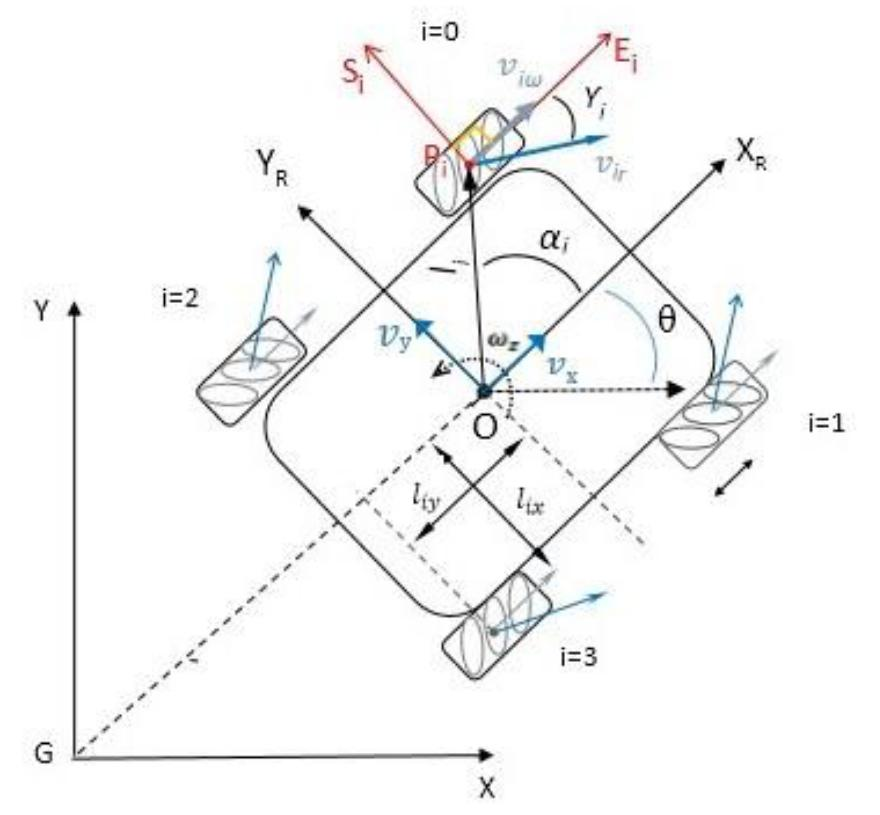

# Robot based on mecanum wheels
robot photo
## Kinematics

### The configuration parameters of the system are defined as follows:
- x, y,  - robot position coordinates and orientation angle
- lx, ly - half of the distance between wheels
- r - radius of the wheels
-  - wheels angular velocity
- vx, vy,  - robot linear and angular velocities
- 
- 

### Inverse kinematics

### Forward kinematics

## Path planning

## Results
video
